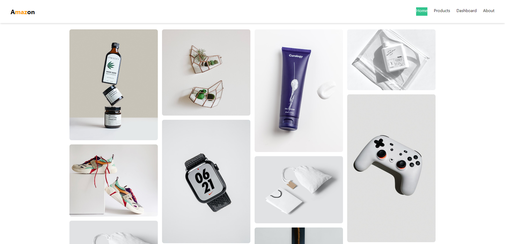
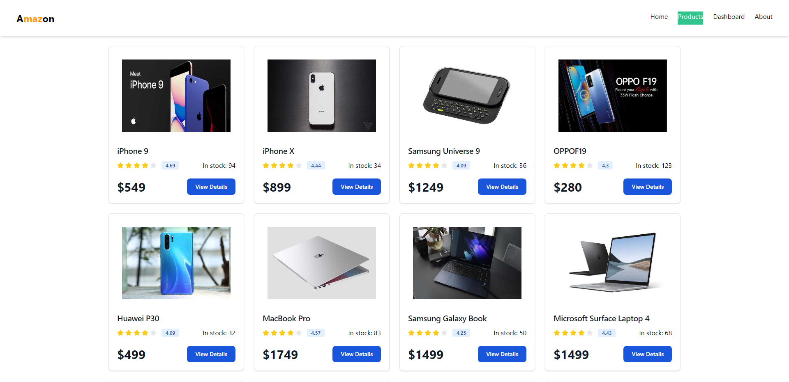
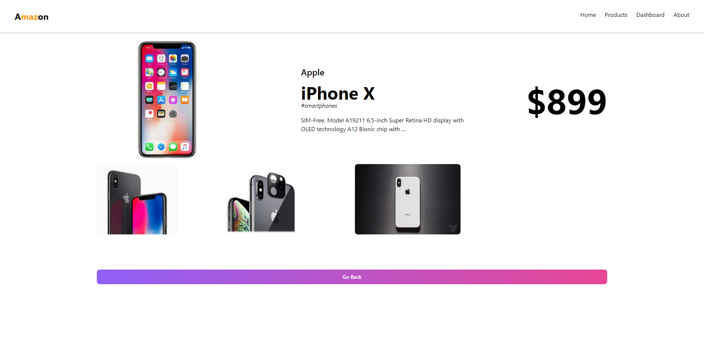

# Amazon like SPA using React Router

Built using React Router, tailwind CSS, Flowbite, and dummyjson products dataset.

### Functionalities

- Click on sections on the navbar to go to either Home, Products, Dashboard or About pages.
- View products cards on the Products page.
- Click View Details on a product to view more details on a separate page.
- Click Go Back button to move one step up from the single Product Details page to the Products page.
- The Dashboard has child pages like Profile and Edit Profile which can be viewed separately while staying on the Dashboard page.
- The website title changes dynamically according to the page you are at.

### Screenshots

_Home Page_
_Products Page_
_Single Product Details_

### Live Link

[Surge](https://amazin-commerce.surge.sh/)
